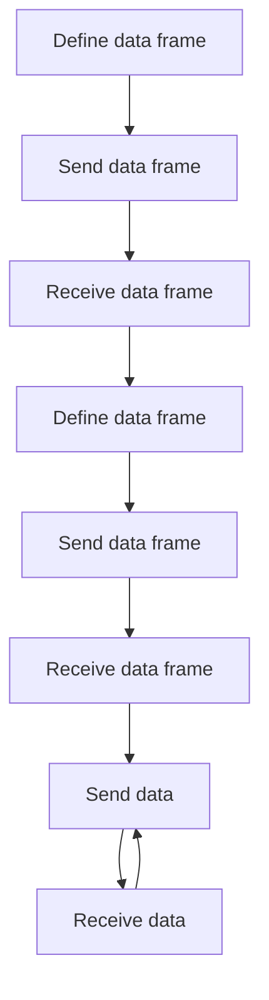

# lib-serial-data-exchange

This library provides a simple way to exchange high level data between am embedded device (C/C++) and a host application (Python).

The main idea is to define a data frame with named fields and their types. The names and types are transmitted just once, at the beginning of the communication. Then, the data is exchanged in the form of a binary stream in order to keep the communication as efficient as possible.

## How it works

The library is composed of two parts: the host side and the device side. Both parts follows the same flow diagram:

### Host side (Python)

The host side is a Python library that provides a class to define the data frame and a class to exchange

### Device side (C/C++)

The device side is a C/C++ library that provides a class to define the data frame and a class to exchange